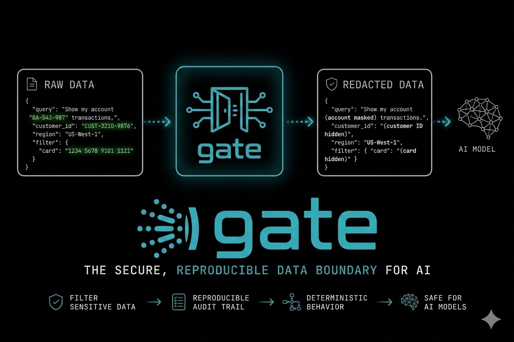
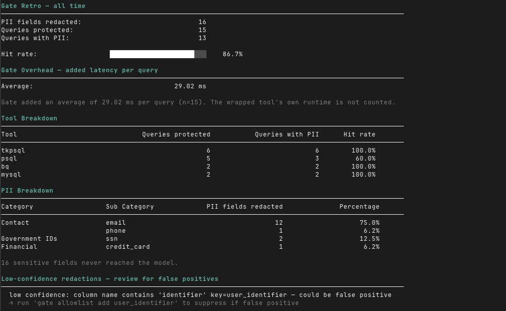

<p align="center">
  
</p>

<p align="center">
  <strong>在你的数据与 AI 之间建立确定性的隐私边界。<br>在模型看到查询结果之前进行拦截——基于规则、可复现、可审计。</strong>
</p>

<p align="center">
  <a href="https://github.com/GaaraZhu/gate/actions"></a>
  <a href="https://github.com/GaaraZhu/gate/releases"></a>
  <a href="https://opensource.org/licenses/MIT"></a>
  <a href="https://github.com/GaaraZhu/homebrew-gate"></a>
</p>

<p align="center">
  <a href="README.md">English</a> | <strong>简体中文</strong>
</p>

---

AI 智能体越来越多地通过 CLI 工具、脚本和 MCP 服务器访问内部数据库与 API。如果缺乏防护，电子邮件、电话号码、税务标识符、支付信息等敏感数据可能会在不经意间暴露给 LLM 的上下文窗口。

`gate` 会在查询结果到达模型之前进行拦截，并自动脱敏检测到的 PII（个人身份信息）字段，无需改动现有的智能体工作流或提示词。它覆盖了智能体使用的两条访问路径：**Bash 命令**（通过 harness 钩子）和 **MCP 服务器调用**（通过 wrap 式的 stdio 代理），每次查询新增开销不足 10 毫秒。

## 为什么用规则，而不是模型？

大多数针对 AI 智能体的 PII 防护工具本身也是 LLM——它们将你的数据发送给模型来判断是否敏感。gate 采取相反的方式。

| | gate | 基于 LLM 的脱敏 |
|---|---|---|
| 判断方式 | 正则 + 列名启发式 + Luhn 算法 | 模型推理 |
| 确定性 | ✅ 相同输入始终产生相同输出 | ❌ 因运行和模型版本而异 |
| 数据留存本地 | ✅ 永远不离开你的机器 | ❌ 需发送至模型 API 进行分类 |
| 延迟 | ✅ 不足 10ms 的开销 | ❌ 增加一次 API 往返 |
| 可审计 | ✅ 每个决策都可追溯到明确的规则 | ❌ 模型推理不透明 |
| 已知缺口 | ✅ 有据可查——自由文本散文 | ❌ 假阴性率未知 |
| 脱敏保证 | ✅ 对已配置工具 100%——自动检测 + `pii.column_denylist` 覆盖所有剩余缺口 | ❌ 无确定性保证 |

gate 的取舍：规则无法捕捉非结构化自由文本中的 PII。[威胁模型](THREAT-MODEL.md) 记录了 gate 不覆盖的范围。

## 为什么不直接在源头脱敏？

数据库级别的脱敏——静态匿名副本、动态数据脱敏（DDM）、行安全策略——在你拥有控制权和配置权限时是正确答案。gate 填补了你没有这些条件时的空缺，并覆盖了脱敏无法触及的路径。

| | gate | 数据库脱敏 |
|---|---|---|
| 需要 DB 管理员权限 | ✅ 无需改动数据库 | ❌ 需要 DBA 进行列级配置 |
| 适用于第三方/外部 DB | ✅ 包装任意返回 JSON 的工具 | ❌ 仅限你自己管理的数据库 |
| 覆盖 MCP 和 API 工具 | ✅ 任意 `tools/call` 响应 | ❌ 该层没有脱敏概念 |
| 生产数据新鲜度 | ✅ 直接作用于实时数据 | ❌ 静态副本会过时；DDM 可能有延迟 |
| 智能体绕过抵抗力 | ✅ 在 harness 钩子中阻断直接值暴露 | ❌ 聚合函数和 CASE 表达式可绕过 DDM |
| 已知缺口 | ✅ 有据可查 | ❌ DDM 缺口通常无声无息 |

两者相辅相成：如果你已配置了 DDM，gate 是覆盖 DDM 遗漏路径和模式的安全网。

## 演示

演示分为三个步骤：

1. `gate scan` 在任何查询运行之前，跨整个 schema 检测出 PII 列
2. 在 gate 禁用状态下，智能体查询 transactions 表——`card_number` 完全可见
3. 在 gate 启用状态下执行同样的查询——`card_number` 在 MCP 和 Bash 两条路径上都被脱敏


> 关于设计理念、威胁模型剖析以及检测流水线的深入解读，请阅读 [**Introducing gate**](https://gaarazhu.github.io/introducing-gate/)。

## 支持的 AI 工具

| AI 工具 | Bash 钩子 | MCP 包裹 | 备注 |
|---|:---:|:---:|---|
| [Claude Code](https://claude.ai/code) | ✅ | ✅ | |
| [Cursor](https://cursor.sh) | ✅ | ✅ | 执行 `gate init` 后重启会话以加载钩子 |
| [OpenCode](https://opencode.ai) | ✅ | ✅ | 执行 `gate init` 后重启会话以加载钩子 |
| [GitHub Copilot CLI](https://github.com/features/copilot) | ✅ | ✅ | 钩子为项目级；每位开发者运行一次 `gate init` |
| [Codex CLI](https://github.com/openai/codex) | ✅ | ✅ | 执行 `gate init` 后，重启会话并在 Permissions 界面中信任并启用该钩子 |
| [Gemini CLI](https://github.com/google-gemini/gemini-cli) | ✅ | ✅ | 执行 `gate init` 后重启会话以加载钩子 |
| [CodeBuddy](https://staging-codebuddy.tencent.com/) | ✅ | ✅ | 执行 `gate init` 后重启会话以加载钩子 |

## 扫描你的 schema

在安装钩子之前，使用 `gate scan` 评估你的 schema 暴露了多少 PII。将一条 `TABLE_NAME, COLUMN_NAME` 查询通过管道传给它，gate 会针对每张表打印风险报告。`gate scan` 本身无需配置。

```bash
psql -U <user> -h <host> -d <dbname> -c "SELECT TABLE_NAME, COLUMN_NAME FROM INFORMATION_SCHEMA.COLUMNS WHERE TABLE_SCHEMA = 'public' ORDER BY TABLE_NAME, ORDINAL_POSITION" | gate scan
```

针对 MySQL、MS SQL Server（含原生 `sqlcmd`）、Databricks 以及 toolkit 管理的客户端的查询语句，以及完整的风险评分说明、黑名单和白名单指南，见 [docs/scan.md](docs/scan.md)。

## 快速上手

1. **安装 gate**（三选一）

   ```bash
   brew tap GaaraZhu/gate && brew install gate  # Homebrew —— macOS 和 Linux（推荐）
   cargo binstall gate                           # cargo binstall —— 下载预编译的二进制文件
   ```

   或直接从 [releases 页面](https://github.com/GaaraZhu/gate/releases) 下载二进制文件。

   在 Homebrew 6.0+ 中，第三方 tap 需要先显式授信才能安装其中的 formula。如果 `brew install gate` 报授信错误，运行 `brew trust GaaraZhu/gate` 后重试。

2. **创建你的配置**（会在编辑器中打开 `~/.config/gate/config.yaml`）：

   ```bash
   gate config
   ```

3. **向你的智能体 harness 注册钩子**：

   ```bash
   gate init                            # Claude Code（默认）
   gate init --harness opencode         # OpenCode
   gate init --harness cursor           # Cursor
   gate init --harness copilot-cli      # GitHub Copilot CLI（项目级，在仓库根目录运行）
   gate init --harness codex            # Codex CLI
   gate init --harness gemini           # Gemini CLI
   gate init --harness codebuddy        # CodeBuddy
   ```

   加上 `--scope project` 可进行仅项目级的安装。执行 `gate init` 后，重启你的 OpenCode、Cursor、Gemini CLI 或 CodeBuddy 会话以加载钩子。对于 Codex CLI，重启会话后，在 Trust & Permissions 界面中查看该钩子，将其标记为受信任并启用。对于 Copilot CLI，请将 `.github/hooks/PreToolUse.json` 加入你的仓库的 `.gitignore`——每位开发者需在本地克隆中各自运行一次 `gate init --harness copilot-cli`。

4. *（可选）* **注册 MCP 服务器代理**，使 `tools/call` 响应也经过 gate：

   ```bash
   gate init --wrap-mcp                             # Claude Code（默认）—— 试运行，显示将会发生的改动
   gate init --harness opencode --wrap-mcp --yes    # OpenCode
   gate init --harness cursor --wrap-mcp --yes      # Cursor
   gate init --harness copilot-cli --wrap-mcp --yes # GitHub Copilot CLI
   gate init --harness codex --wrap-mcp --yes       # Codex CLI
   gate init --harness gemini --wrap-mcp --yes      # Gemini CLI
   gate init --harness codebuddy --wrap-mcp --yes   # CodeBuddy
   ```

   加上 `--scope project` 可使用项目级的 MCP 配置。对于 Cursor 的项目级 MCP，注册后需在 **Settings → Tools & MCPs** 中重新启用相关服务器。关于 `--servers`、各 harness 的路径以及手动注册单个服务器，见 [docs/mcp.md](docs/mcp.md)。

5. **启动你的 AI 会话**——`gate` 会自动拦截查询命令。无需改动你的提示词或工具。

在首次会话前运行 `gate validate` 以确认配置有效。

## 团队协作

个人配置（`~/.config/gate/config.yaml`）不会随仓库一起流转——一位开发者调高阈值或新增模式规则，并不会让其他人受益。提交到仓库的 `config.yaml` 解决了这个问题。

```bash
# 团队负责人，只需一次，在仓库根目录下执行：
gate export                          # 将个人配置中的 tools/patterns/thresholds 写入 ./config.yaml
git add config.yaml && git commit -m "add gate team config"

# 其他所有人（在上面快速上手中的 gate init 之后）：
git clone <repo>
gate config --sync                   # 拉取 config.yaml，并将其合并进个人配置
```

合并规则只会收紧防护——项目配置可以提高阈值、新增工具和模式规则，但绝不会削弱防护——但 `column_allowlist` 是一个明确标注的例外。完整的合并规则，以及为什么 `gate config --sync` 会把它写入个人配置而不只是实时读取，见 [docs/team.md](docs/team.md)。

## 工作原理

`gate` 覆盖了智能体访问数据的两条路径。[博客文章](https://gaarazhu.github.io/introducing-gate/) 提供了完整的讲解；简要版本如下：

### Bash 工具路径

每条 Bash 命令都会先经过 `gate hook`。匹配到已配置工具的命令会被静默改写为 `gate run -- <原始命令>`，由它启动子进程并将 stdout 通过双门检测流水线。这一改写是强制性的——智能体无法绕过。

```
AI 请求运行: tkpsql query --sql "SELECT * FROM users"
                        │
         harness 钩子触发 (PreToolUse / tool.execute.before)
                        │
              gate hook 改写为: gate run -- tkpsql query --sql "..."
                        │
         ┌──────────────┴──────────────┐
         │ Gate 1: SQL 检查            │  SELECT * → 无列名提示，交给 Gate 2
         │ Gate 2: 字段值扫描          │  正则 + 列名启发式 + Luhn 校验
         └──────────────┬──────────────┘
                        │
         {"id": 1, "full_name": "[PII:name]", "email": "[PII:email]", ..., "_gate_summary": {...}}
```

### MCP 路径

`gate mcp` 是一个透明的 stdio 代理，在 harness 中作为 MCP 服务器注册。它原样转发所有 JSON-RPC 流量，唯独 `tools/call` 响应会先经过 Gate 2 再到达模型。无需对上游服务器做任何改动。

> **注意：** 仅 `tools/call` 响应会被脱敏——`resources/read`、`prompts/get` 以及其他 MCP 消息类型会被转发而不经检查。

```
AI ──tools/call──> gate mcp ──转发──> 上游 MCP 服务器
                       │
                       │ <── 含 PII 的 tools/call 响应
                       │
                       │ Gate 2 扫描 + 脱敏
                       │
AI <───脱敏后的结果─────┘
```

### 输出

PII 值会被替换为 `[PII:<type>]` 占位符，原始 JSON 结构保持不变。并追加一个 `_gate_summary` 字段，报告脱敏了哪些内容。

```json
{
  "rows": [{"id": 1, "email": "[PII:email]", "ssn": "[PII:ssn]"}],
  "count": 1,
  "_gate_summary": {"redacted": 2, "types": ["email", "ssn"], "warnings": []}
}
```

输出选项（包括确定性值哈希）见 [docs/configuration.md](docs/configuration.md)。

## gate 不防护什么

`gate` 是一个确定性的脱敏层，而非沙箱。主要限制：

- **不在 `tools:` 中的命令。** AI 可自由调用它们；它们的输出绝不会被检查。
- **非 JSON 的工具输出。** 纯文本、CSV 及其他格式会原样透传。
- **自由文本散文。** 嵌入在非结构化文本字段中的 PII 无法被检测到。
- **对抗性智能体 / 提示注入。** gate 假定智能体是无意中泄露 PII——蓄意的攻击者可以绕过它。
- **已存在于模型上下文中的 PII**——来自先前的对话轮次、系统提示或文件读取。

完整的攻击者模型、已知绕过方式及更严格配置的建议，见 [THREAT-MODEL.md](THREAT-MODEL.md)。

## 防护回顾

`_gate_summary` 报告的是单次响应。`gate retro` 会跨所有响应进行汇总——总查询数、已脱敏的 PII 字段数、命中率，以及按工具和 PII 类别的细分。适用于定期审计，以及确认这道边界确实在发挥作用。

若任何查询产生了低置信度脱敏，`gate retro` 会显示一个**低置信度脱敏**部分，列出每个唯一警告列以及对应的 `gate allowlist add <col>` 命令供你直接抑制。将列加入白名单后，它会自动从该部分消失。



统计数据默认收集并写入磁盘上的本地 JSONL 日志——它们绝不会离开你的机器。在配置中设置 `stats.enabled: false` 可禁用。

## 支持的查询工具

任何返回 JSON 的命令都可以配置为 `gate` 的目标——数据库客户端、通过 `curl` 进行的内部 API 调用，或你的 AI 智能体用来获取数据的任何其他工具。AI 看到的仍是它一贯看到的那种结构化响应，只是 PII 值被原地替换了。

| 命令 | 类型 | 备注 |
|---|---|---|
| `tkpsql` | PostgreSQL（toolkit 管理） | `sql_arg: "--sql"` |
| `tkmsql` | MS SQL Server（toolkit 管理） | `sql_arg: "--sql"` |
| `tkdbr` | Databricks（toolkit 管理） | `sql_arg: "--sql"` |
| `databricks` | Databricks CLI（原生） | `sql_arg: "--json"`, `json_sql_path: "statement"` |
| `curl` | HTTP 数据源 | `pipe: "jq -c ."` |
| `psql`、`mysql`、`mariadb` | 原始数据库客户端 | **默认未启用**——见 [原始数据库客户端](docs/configuration.md#raw-database-clients-opt-in) |

相比原始客户端，更推荐使用 toolkit 命令或 MCP 服务器：原始客户端通常需要在命令行上提供凭据，而这会落入智能体的对话记录、shell 历史和进程列表中。toolkit 命令（[`tk*`](https://github.com/scott-abernethy/toolkit)）从密钥存储中注入凭据；MCP 服务器则完全隐藏连接字符串。`gate` 适用于任何返回 JSON 的命令——并非必须使用 toolkit。

## 命令

```bash
gate --help                    # 完整的子命令列表
gate <subcommand> --help       # 任意子命令的详情
```

你最常用的几个：

| 命令 | 用途 |
|---|---|
| `gate init` | 向你的 harness 注册钩子（见快速上手） |
| `gate export` | 将个人配置写入 `config.yaml` 以便与团队共享（见团队协作） |
| `gate config` | 创建并编辑 YAML 配置；`--sync` 用于拉取团队配置（见团队协作） |
| `gate scan` | 跨 schema 的 PII 风险报告 |
| `gate allowlist add/remove/list` | 管理列名误报 |
| `gate retro` | 防护回顾——总查询数与已脱敏 PII 字段数、按工具和 PII 类型/类别的细分、带可视化进度条的命中率 |
| `gate log [-f]` | 实时查看拦截事件——查看 gate 匹配、脱敏或阻止了哪些内容。仅包含计数与标签，绝不包含原始命令行或 PII |
| `gate enable` / `gate disable` | 在不卸载的情况下开关脱敏 |
| `gate validate` | 在首次会话前检查配置中的错误；当存在团队配置时还会显示其来源信息 |
| `gate protect` / `gate unprotect` *（仅 Unix）* | 将配置文件所有权转移给 root |
| `gate uninstall` | 移除 gate 添加到你系统中的所有内容 |

完整参考（包括 `gate run`、`gate mcp` 以及 `--wrap-mcp` / `--scope` / `--harness` 标志）见 [docs/commands.md](docs/commands.md)。

### 配置文件保护（仅 Unix）

为获得更强的保证，将配置文件的所有权转移给 root，使智能体无法修改它：

```bash
sudo gate protect      # 之后任何 enable/disable/config/allowlist 操作都需要 sudo
sudo gate unprotect    # 恢复直接写入权限
```

在操作系统层面跨所有 harness 强制执行（Claude Code、OpenCode、Cursor、GitHub Copilot CLI、Codex CLI、Gemini CLI、CodeBuddy）。不支持 Windows。

## 文档

- [配置](docs/configuration.md) —— 完整的 YAML schema 与内置 PII 检测规则
- [团队配置](docs/team.md) —— 通过提交到仓库的 `config.yaml` 在团队间共享配置
- [命令](docs/commands.md) —— 完整的子命令参考
- [MCP 设置](docs/mcp.md) —— 包裹现有 MCP 服务器并注册新服务器
- [扫描查询](docs/scan.md) —— 各数据库的 schema 查询示例
- [配置文件位置](docs/config-locations.md) —— 各 harness 存放钩子和 MCP 设置的位置
- [故障排查](docs/troubleshooting.md) —— 常见问题与解决方法

## 卸载

```bash
gate uninstall
brew uninstall gate
```

`gate uninstall` 会从所有 harness 中移除 gate 钩子、位于 `~/.config/gate/` 的配置目录，以及任何由 gate 生成的插件文件。它会显示将要删除的内容并请求确认。

## 贡献

欢迎提交 bug 报告和 pull request。对于重大改动，请先开 issue 讨论方案。开发环境搭建、提交前检查清单以及脱敏改动的安全规则，见 [CONTRIBUTING.md](CONTRIBUTING.md)。

## 许可证

MIT —— 见 [LICENSE](LICENSE)。

## 免责声明

见 [DISCLAIMER.md](DISCLAIMER.md)。
